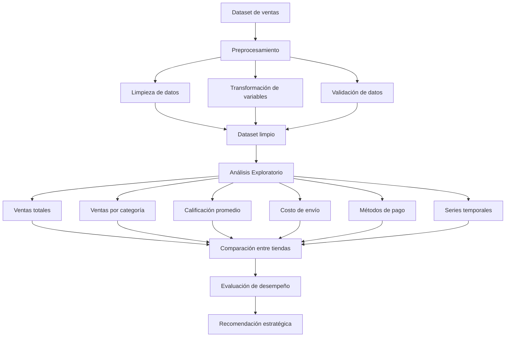
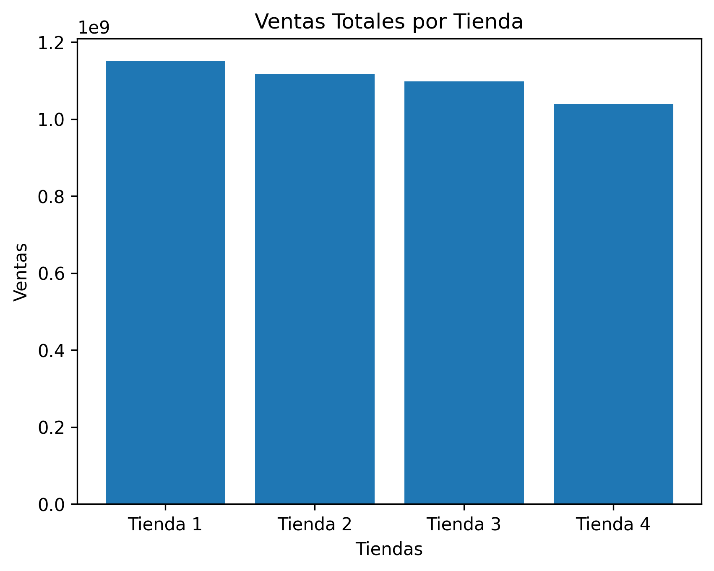
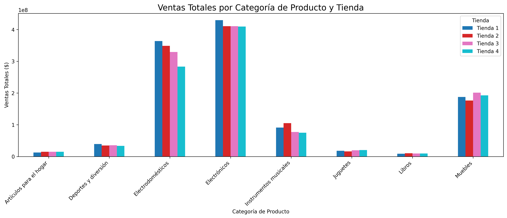
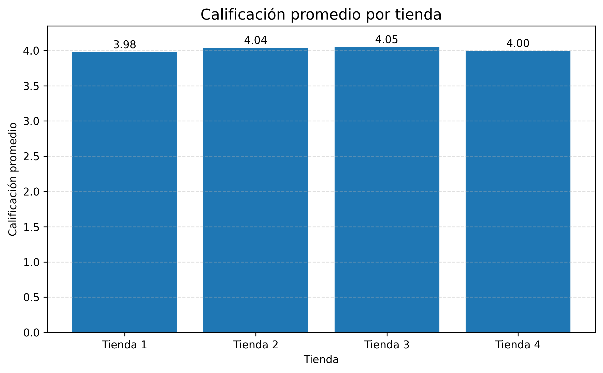
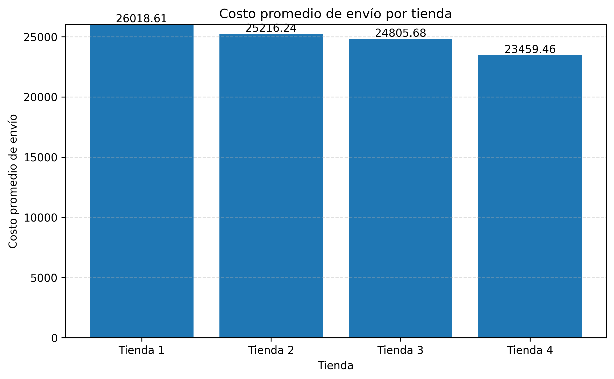
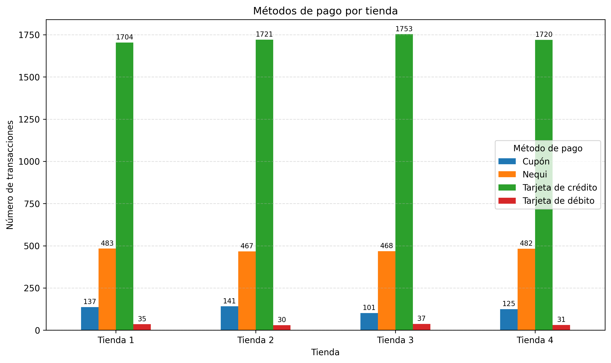
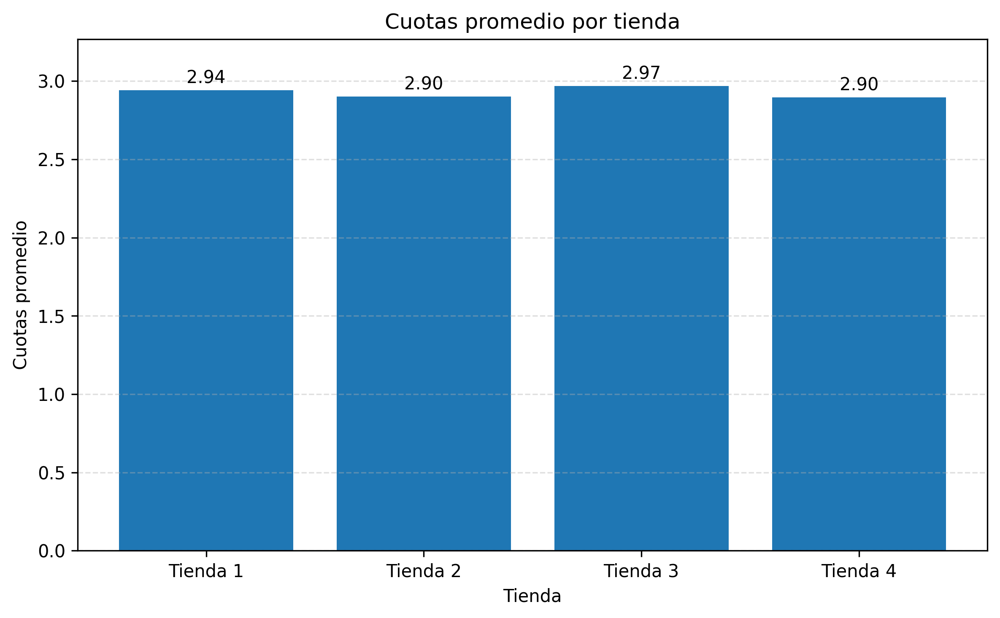
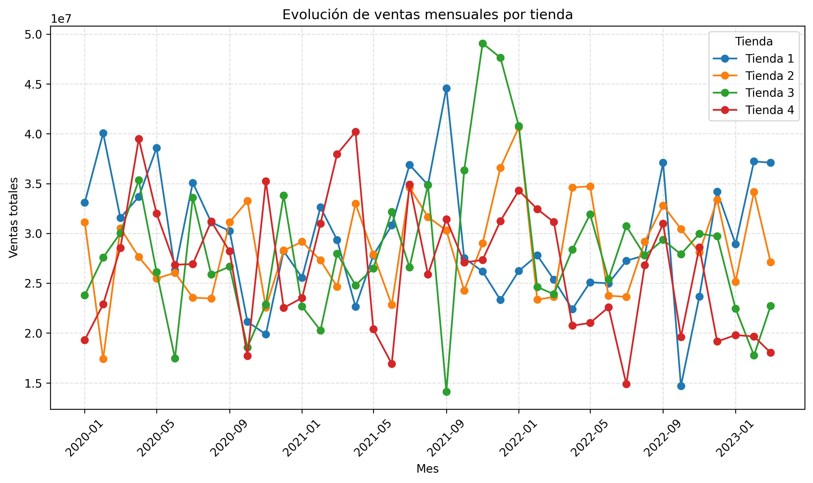

# 🛍️ Análisis de Eficiencia de Tiendas
## Alura Store LATAM


---

# 🚀 Proyecto de Análisis de Datos End-to-End

Este proyecto analiza el desempeño de **cuatro tiendas de Alura Store LATAM** con el objetivo de identificar cuál presenta el **menor rendimiento global** y sustentar una decisión estratégica de negocio.

El análisis se basa en métricas reales de operación:

- ventas
- comportamiento de clientes
- logística
- métodos de pago
- evolución temporal

---

# 🎯 Objetivo del Proyecto

Determinar qué tienda tiene el **peor desempeño integral**, considerando múltiples dimensiones del negocio y no solo ingresos.

---

# 🧠 Flujo de Análisis

Dataset de ventas  
↓  
Limpieza y transformación  
↓  
Análisis exploratorio (EDA)  
↓  
Construcción de métricas  
↓  
Visualización  
↓  
Comparación multivariable  
↓  
Conclusión estratégica

---

# 🏗 Arquitectura del Análisis



---

# 📊 Ventas Totales por Tienda



### Hallazgo

- Existe una diferencia clara en ingresos entre tiendas
- **Tienda 1 y Tienda 2 lideran en ventas**
- **Tienda 4 se mantiene consistentemente por debajo**

👉 Primera señal de bajo desempeño: **Tienda 4 genera menos ingresos**

---

# 📦 Ventas por Categoría



### Hallazgo

- Las tiendas con mejor desempeño muestran mayor volumen y diversidad comercial
- **Tienda 4 presenta menor participación en múltiples categorías**

👉 Esto sugiere menor capacidad de atracción de clientes y menor cobertura de mercado

---

# ⭐ Calificación Promedio



### Hallazgo

- Todas las tiendas presentan calificaciones muy cercanas a 4.0
- **Tienda 1 registra la calificación promedio más baja (3.98)**
- **Tienda 3 registra la más alta (4.05)**

👉 La satisfacción del cliente es bastante homogénea y no constituye, por sí sola, un factor decisivo para explicar la brecha de desempeño comercial

---

# 🚚 Costo Promedio de Envío



### Hallazgo

- **Tienda 1 tiene el costo promedio de envío más alto (~26,018)**
- **Tienda 4 tiene el costo promedio más bajo (~23,459)**

👉 Aunque Tienda 4 muestra eficiencia logística relativa, esa ventaja no se traduce en mejores ventas ni en una posición competitiva superior

---

# 💳 Métodos de Pago



### Hallazgo

- La **tarjeta de crédito** domina ampliamente en las cuatro tiendas
- **Nequi** ocupa consistentemente el segundo lugar
- **Cupón** y **tarjeta de débito** tienen una participación significativamente menor
- La estructura de pago es muy similar en todas las tiendas

👉 Los métodos de pago no presentan diferencias suficientes para explicar el menor rendimiento de una tienda específica

---

# 💳 Cuotas Promedio



### Hallazgo

- El promedio de cuotas es muy estable entre tiendas, alrededor de **2.9 a 3.0**
- **Tienda 3** registra el valor ligeramente más alto
- **Tienda 2 y Tienda 4** presentan los valores más bajos

👉 El financiamiento al cliente se comporta de forma homogénea y tampoco representa una palanca diferencial de desempeño

---

# 📈 Evolución de Ventas en el Tiempo



### Hallazgo

- Todas las tiendas presentan variabilidad mensual en sus ventas
- **Tienda 3 muestra los picos más altos**, lo que indica mayor potencial comercial
- **Tienda 4 se mantiene con frecuencia en el rango inferior del comportamiento mensual**
- No se observa una tendencia de recuperación clara y sostenida para Tienda 4

👉 El desempeño temporal confirma que Tienda 4 no solo vende menos en términos agregados, sino que tampoco muestra señales robustas de crecimiento relativo

---

# 🏆 Conclusión Estratégica

El análisis integrado de ventas totales, ventas por categoría, comportamiento temporal, costos logísticos y métricas comerciales indica que:

## 🔴 Tienda 4 es la unidad con menor rendimiento global

### Evidencia integrada

- Presenta el **menor nivel de ventas totales**
- Muestra **menor participación en distintas categorías**
- Su comportamiento en el tiempo se mantiene **frecuentemente por debajo del resto**
- No posee una ventaja diferencial en experiencia del cliente
- No presenta una estructura de pagos que explique o compense su bajo desempeño
- Aunque su costo de envío es el más bajo, esa eficiencia no logra traducirse en tracción comercial

---

# 🎯 Recomendación

👉 **Se recomienda la descontinuación o una reestructuración profunda de la Tienda 4**, ya que concentra la combinación menos favorable entre volumen comercial, presencia por categoría y desempeño sostenido en el tiempo.

---

# 💡 Impacto de Negocio

- optimización de recursos
- reducción de costos operativos
- enfoque en tiendas con mayor potencial
- mejora de la eficiencia global del portafolio

---

# 🛠 Tecnologías Utilizadas

Python  
Pandas  
NumPy  
Matplotlib  
Seaborn  
Google Colab  
GitHub

---

# 📁 Estructura del Proyecto

```text
alura-store-analysis/

├── AluraStoreLatam.ipynb
├── README.md
└── images/
```

---

# 👨‍💻 Autor

**Carlos Patricio Luis Castillo**

Proyecto de Ciencia de Datos aplicado a análisis de negocio.

---

⭐ Si este proyecto te aporta valor, dale una estrella al repositorio.
